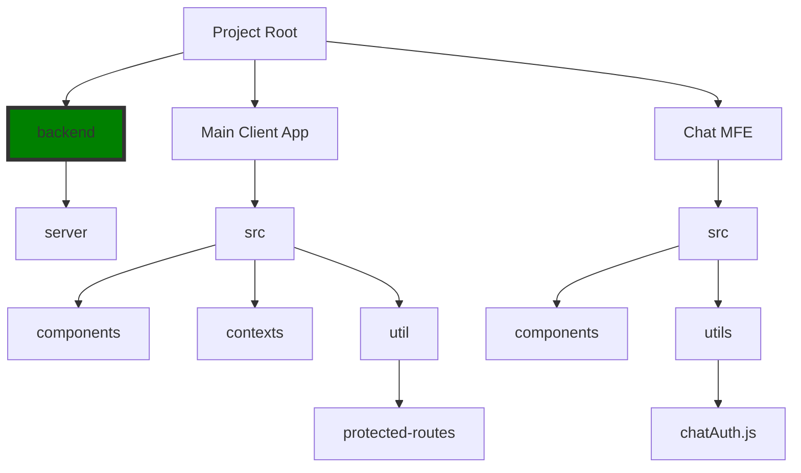

```mermaid
graph TD
A[Project Root]
A --> B[Main Client App]
A --> C[Chat MFE]
A --> P[backend]
P --> T[server]
B --> D[src]
D --> E[components]
D --> F[contexts]
D --> G[util]
G --> H[protected-routes]
C --> I[src]
I --> J[components]
I --> K[utils]
K --> L[chatAuth.js]

    style P fill:green,stroke:#333,stroke-width:4px
```
